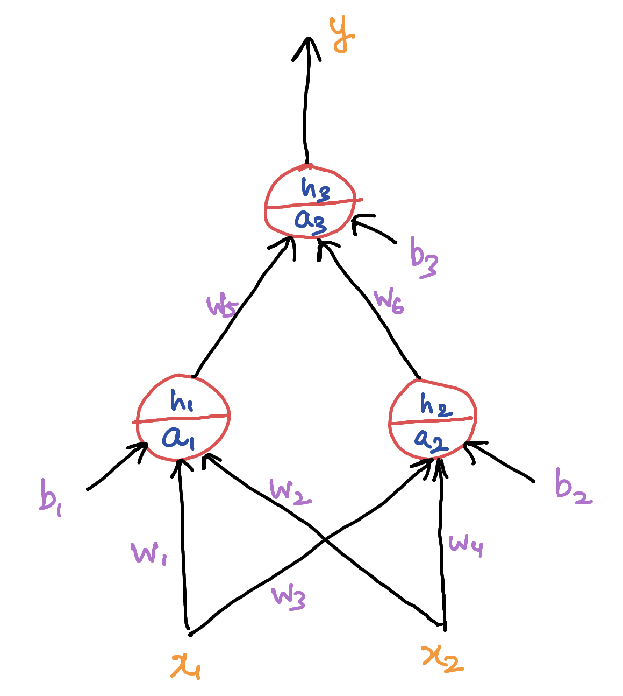
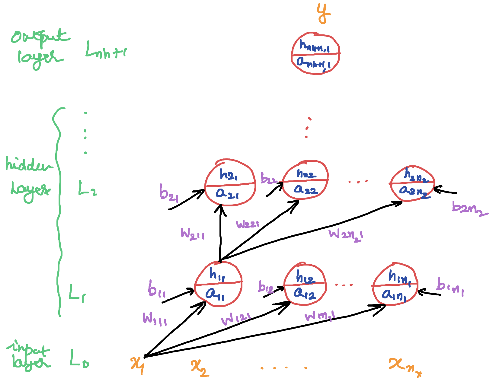
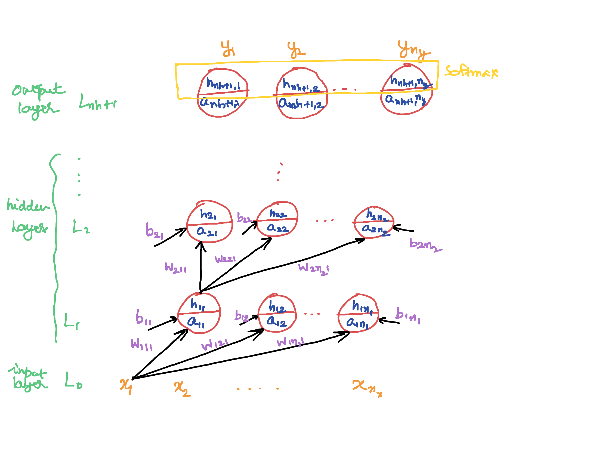
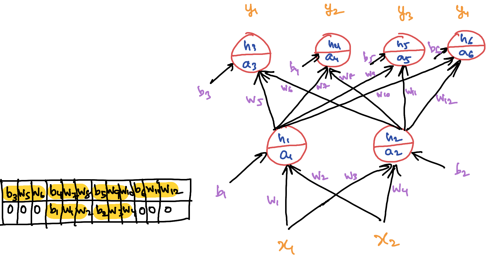
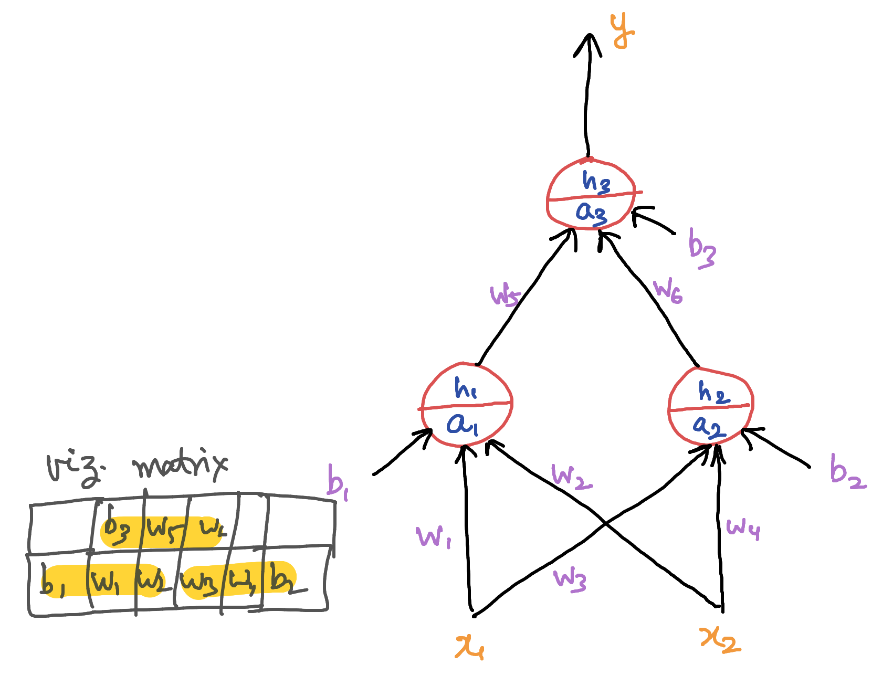

# Feedforward Neural network

A single neuron with whatever activation function has limited approximation properties however a small network of neurons can approximate a complex non-linear function.

The notebook `0318_FeedForwardNetwork_new-1553058835338.ipynb` gives the demonstration for the same for the following feedforward (FF) network structure and the generalized FF network having `nx`, `ny` number of input, output nodes and `nh` number of hidden layers.

**Fig: Simple FF network**

**Fig: Generalized FF with one output node**

**Fig: Generalized FF with many output nodes**

The notebook `0328_VectorizedFeedForwardNetworks-1553747879251.ipynb` reviews the scalar approach for the implementation and also showcases the vectorized approach with weights only and vectorized approach with weights and inputs from scratch for the following network

The vectorized approach with weights and inputs is the most efficient with significant improvement in terms of neural network training time requirement (approx. 4 sec.) as opposed to other approaches (approx 14 sec.)

Exercise network is 
