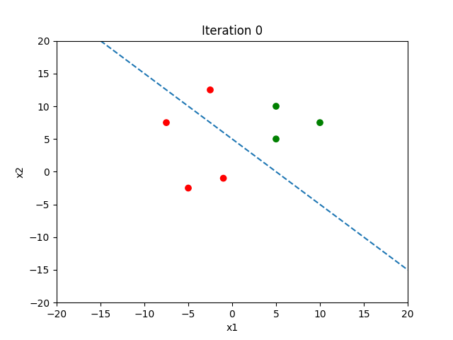
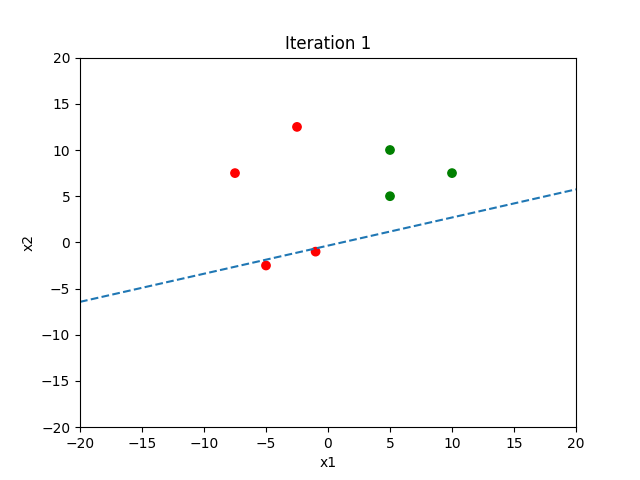
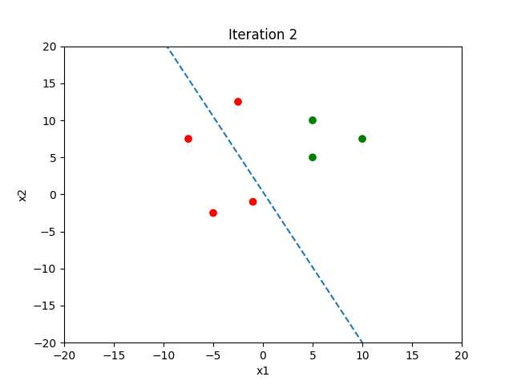
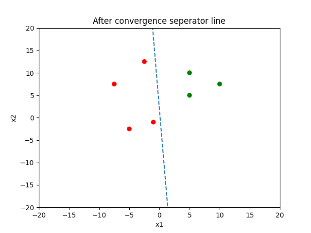

# Perceptron learning algorithm demo

## How to run

Create a virtual environment and install the dependencies. Run `perceptron.py` to get the result.

## Results

For the demo, I have considered two features and their weights as $w_{1} = w_{2} = 1$ and threshold $b=5.0$. The algorithm converged after 3 iterations and their respective graphs are as follows:

