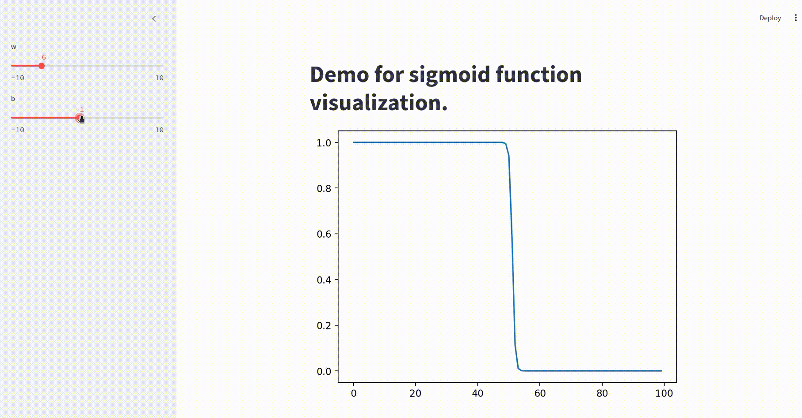

# Sigmoid Neuron

Sigmoid neuron has formula $S_{w,b}(x) = \frac{1}{1+e^{-(w*x+b)}}$

The jupyter notebook contains the class and visualization for it. There is one streamlit app script `visualize_sigmoid.py` where you can play with parameters `w` and `b` to understand how it affects the function. Check below sample output.

We can see that for positive values of `w` we get the normal curve where function is flipped one for negative. Positive values of `b` shift the curve to the left while negative values to the right.
